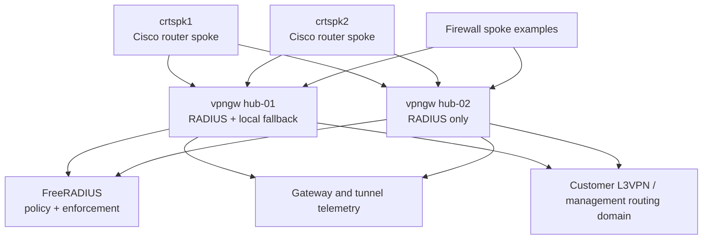

# Lab Configuration Notes

This folder contains sanitized configuration examples for the programmable IPsec
VPN gateway proof of concept.

The lab used two Cisco IOS XE hub routers, two Cisco router spokes, a FreeRADIUS
server, and firewall spoke examples. The hub routers terminated IKEv2/IPsec
tunnels, requested policy from RADIUS, applied dynamic VTI attributes, and
exchanged management routes with spokes through BGP.

This folder shows a `vpngw` control-plane concept: tunnels can be
created programmatically, policy can be inserted dynamically onto tunnel
interfaces, and supported policy updates can be made while tunnels stay up.
RADIUS is the enforcement source for identity, authorization attributes,
dynamic authorization, and accounting events. Where supported by the platform,
policy can be refreshed without taking an active tunnel down; when a full
reauthorization or rebuild is required, the same control-plane model can trigger
an intentional tunnel reset.

The pattern is conceptually similar to cloud VPN gateways from AWS, Azure, and
Google Cloud: IPsec tunnels terminate on a gateway and are attached to a routed
customer network. In this lab, the attachment target is a customer L3VPN or
management routing domain rather than a public-cloud VPC or VNet.

## Lab Roles

- `hub-01.lab.example.net` - Hub router configured for RADIUS-backed authorization with local fallback.
- `hub-02.lab.example.net` - Hub router configured for RADIUS-backed authorization only.
- `crtspk1.lab.example.net` - Cisco router spoke behind a NAT-style edge.
- `crtspk2.lab.example.net` - Cisco router spoke with direct lab reachability.
- `radius-server.example.net/` - FreeRADIUS example clients, users, and build notes.

## Background

The proof of concept was originally built in 2018 to test routed IPsec Virtual
Tunnel Interface connectivity into an isolated management network from multiple
spoke types, including Cisco routers and firewall spokes. The hubs were Cisco
CSR1000v FlexVPN provider-edge style routers running IOS XE-era software, and
RADIUS was used to centralize IKEv2 PSK lookup, user/group authorization
attributes, dynamic policy insertion, and accounting.

For public sharing, the live access instructions, environment-specific topology
screenshots, organization-specific domains, and reusable credentials were
removed or replaced with placeholders.

## Objectives

1. Configure FreeRADIUS as the policy source for IKEv2 keying, authorization, and accounting.
2. Configure `hub-01` for RADIUS with local fallback behavior.
3. Configure `hub-02` for RADIUS-only behavior.
4. Establish IPsec VTI tunnels from router and firewall spokes to both hubs.
5. Review programmatic tunnel creation and supported live policy refresh without resetting active tunnels.
6. Review intentional programmatic tunnel reset when full reauthorization or rebuild is required.
7. Establish BGP neighbors across the tunnels.
8. Verify gateway state, tunnel uptime, traffic counters, accounting events, and customer L3VPN or management reachability.

## Topology

## Config Review Flow

Begin with `radius-server.example.net/rad-01.users` to see how IKEv2 identities
map to PSKs and dynamic tunnel attributes. Then compare `hub-01.lab.example.net`
and `hub-02.lab.example.net` to understand the operational difference between
fallback and RADIUS-only designs. The RADIUS attributes show how a controller or
operator workflow can add a tunnel, update supported policy in real time, and
observe tunnel uptime, traffic, and accounting without manually rebuilding hub
configuration. The `aaa server radius dynamic-author` blocks in the hub configs
show where controller-triggered reset or disconnect workflows fit when a tunnel
must be fully reauthorized. The router spoke files show the matching IKEv2
keyring, VTI, BGP neighbor configuration, and routed attachment into the
customer L3VPN or management domain.

## Sanitization Notes

- Placeholder values use names like `<REPLACE_WITH_RADIUS_SHARED_SECRET>` and `<REPLACE_WITH_BGP_PASSWORD>`.
- RFC 5737 documentation IP ranges are used for public-facing examples:
  `192.0.2.0/24`, `198.51.100.0/24`, and `203.0.113.0/24`.
- `PUBLIC` is a generic lab VRF name for the outside-facing transport side.
- Private lab subnets remain where they help explain tunnel and management routing.
- No live SSH access details are included.

## Private Lab Replacement Notes

Before using these files in a private lab, replace the RADIUS shared secret,
IKEv2 identities, PSKs, local user secrets, BGP passwords, documentation
addresses, outside-interface values, VRF names, and any route targets or route
distinguishers that must match the local topology.
