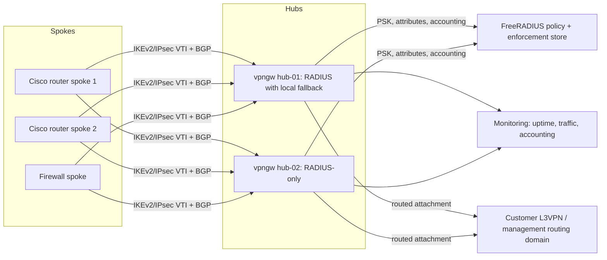

# Programmable IPsec VPN Gateway Proof Of Concept

Reference configurations and review notes for a programmable IPsec VPN
gateway concept built on routed tunnel interfaces, centralized RADIUS policy,
and dynamic per-tunnel configuration.

This repository packages a programmable VPN gateway proof of concept as a public
reference asset. This folder preserves the architecture and command patterns while
replacing internal values,credentials, and environment-specific details. The lab explored how
Cisco IOS XE hub routers could terminate IPsec/FlexVPN spokes, use RADIUS for
IKEv2 pre-shared key and authorization data, and exchange management routes with
spokes through BGP. The files have been sanitized and refreshed for public
review while preserving the useful architecture and command patterns.

The main purpose of this reference asset is to show a VPN gateway (`vpngw`) model where new
IPsec tunnels can be created, updated, and governed programmatically. Instead of
prebuilding every spoke as static gateway configuration, the hub creates tunnel
interfaces on demand, inserts policy from RADIUS, supports real-time policy
refreshes for active tunnels where the platform allows it, supports intentional
programmatic tunnel resets through RADIUS dynamic authorization workflows, and
exposes operational signals such as gateway status, tunnel uptime, traffic,
accounting events, and route reachability.

## Value Proposition

The lab shows a repeatable way to move VPN access policy out of static
device configuration and into a central AAA/RADIUS control point. That makes the
design useful for showing how VPN gateways can authenticate peers, create routed
tunnel interfaces, insert per-spoke policy, and exchange routes without building
a one-off configuration for every remote site.

For public review, this is the important takeaway: a VPN gateway can behave like
a programmable service endpoint. RADIUS supplies enforcement data, the gateway
applies that policy automatically, tunnel policy can be adjusted programmatically
without rebuilding static config. Supported policy can be refreshed without
taking down an active tunnel, and a controller can also intentionally reset a
tunnel when a full reauthorization or rebuild is required. Telemetry and
accounting can then be used to show gateway health, tunnel state, tunnel uptime,
and traffic activity.

Conceptually, this is comparable to the managed VPN gateway pattern used by AWS,
Azure, and Google Cloud: IPsec tunnels terminate on a gateway service and are
then attached to a routed customer network. In public clouds, that attachment is
usually a VPC, VNet, or cloud routing domain. In this lab, the same gateway idea
is applied to customer L3VPN or management routing domains, with FlexVPN tunnel
interfaces carrying the routed attachment.

The backend/control-plane pattern is similar to common hub-and-spoke VPN
concentrator designs: centralized hubs terminate IKEv2/IPsec, RADIUS
externalizes per-peer policy, and BGP carries reachability between the
customer L3VPN or management routing domain and each spoke. In Cisco terms, the
design aligns most closely with FlexVPN dynamic VTI patterns, with concepts that
overlap with DMVPN-style hub/spoke operations.

## Audience

This repo is intended for:

- Network engineers evaluating routed IPsec VTI designs.
- Security engineers reviewing AAA-backed VPN authorization patterns.
- Platform engineers thinking about VPN gateway automation and policy APIs.
- Architects comparing local device configuration against centralized policy control.
- Cloud networking practitioners mapping public-cloud VPN gateway concepts to customer L3VPN environments.
- Engineers and architects who need a concise, explainable reference workflow.
- Learners who want realistic IOS XE and FreeRADIUS examples without using production credentials.

## Use Cases

- Review a programmable VPN gateway (`vpngw`) pattern using Cisco FlexVPN and IPsec tunnel interfaces.
- Show dynamic FlexVPN policy insertion onto IPsec tunnel interfaces.
- Create or update tunnel definitions programmatically in near real time.
- Refresh supported tunnel policy programmatically without taking down an established tunnel.
- Programmatically reset or disconnect a tunnel when a full rebuild or reauthorization is required.
- Show RADIUS-provided IKEv2 PSK, user authorization, group authorization, and accounting.
- Compare hub behavior with RADIUS-plus-local fallback versus RADIUS-only enforcement.
- Monitor gateway health, tunnel state, tunnel uptime, traffic counters, and accounting events.
- Compare the design to cloud VPN gateway patterns that terminate IPsec and attach tunnels to routed customer networks.
- Explain how BGP can advertise spoke management subnets across VPN tunnels.
- Use sanitized FlexVPN configuration snippets as starting points for a private lab or controller-driven prototype.

## Repository Tour

1. `vpngw` concept: VPN hubs act as programmable service endpoints, similar in concept to cloud VPN gateways.
2. Topology: two VPN gateways, a RADIUS policy source, and multiple spoke types.
3. RADIUS policy: IKEv2 identities map to PSKs, dynamic tunnel attributes, and enforcement policy.
4. `hub-01`: RADIUS-backed authorization with local fallback.
5. `hub-02`: stricter RADIUS-only policy retrieval and enforcement.
6. Automation model: a controller or operator workflow can add, refresh, or reset tunnel policy through RADIUS-backed automation.
7. Router spokes: IKEv2 keyring, VTI, BGP, and routed attachment examples.
8. ASA spoke reference: firewall-oriented snippets in `ASA-spoke--hub-reference-config/`.
9. Operational checks: gateway reachability, tunnel state, tunnel uptime,
   traffic counters, RADIUS auth/accounting, BGP neighbors, and management route
   reachability.

## Architecture And Workflow

Workflow summary:

- Spokes initiate IKEv2 to a hub public address.
- The hub asks RADIUS for keying and authorization details associated with the remote IKEv2 identity.
- RADIUS returns Cisco AVPair attributes that shape the dynamic tunnel interface and insert policy.
- The hub and spoke bring up a routed IPsec VTI.
- Supported tunnel policy can be refreshed programmatically through the policy source without hand-editing gateway config or dropping the active tunnel.
- RADIUS dynamic authorization can be used for intentional tunnel reset or disconnect workflows when policy must be fully reapplied.
- BGP exchanges customer L3VPN or management reachability across the tunnel.
- Accounting records mark tunnel start, stop, and update events.
- Gateway and tunnel telemetry can be used to show uptime, traffic, and operational state.

## Repository Layout

- `LabConfig/` - Sanitized lab configuration examples for the hubs, router spokes, and FreeRADIUS server.
- `LabConfig/radius-server.example.net/` - FreeRADIUS client, user, and build notes.
- `ASA-spoke--hub-reference-config/` - Sanitized ASA spoke reference snippets retained from the original lab package.
- `SECURITY.md` - Security policy and public handling guidance.

## Prerequisites

To reproduce the lab privately, you need:

- Cisco IOS XE routers that support IKEv2, IPsec VTI/DVTI, VRF, AAA, and BGP.
- FreeRADIUS 3.x or a compatible RADIUS server.
- A controlled lab network with non-production addressing.
- Replacement secrets for every placeholder value.
- Optional firewall spokes if you want to review ASA-style remote peers.
- Operational familiarity with IOS XE, FreeRADIUS, IKEv2, IPsec, BGP, and VRF routing.

## Sanitization Notes

- All passwords, PSKs, RADIUS shared secrets, BGP passwords, enable secrets, and local user passwords are placeholders.
- Public or company-specific IP addresses were replaced with RFC 5737 documentation ranges where practical:
  `192.0.2.0/24`, `198.51.100.0/24`, and `203.0.113.0/24`.
- The `PUBLIC` VRF name is a generic lab label for the outside-facing transport VRF, not a live network identifier.
- Company-specific domains and internal image links were removed from user-facing docs.
- The original 2018 proof-of-concept context is preserved as provenance, but the
  examples should be treated as templates, not deployment-ready configs.
- Before using this design in a real environment, generate unique secrets,
  select current cryptographic policy, and validate the platform-specific syntax
  on your target software release.

## Private Lab Replacement Notes

Before adapting the proof of concept to a private lab, replace all placeholder
secrets, documentation IP ranges, lab-local domains, VRF names, RADIUS shared
secrets, BGP passwords, IKEv2 identities, crypto policy, and platform-specific
interface names. Revalidate the design against the exact IOS XE and FreeRADIUS
versions used in the target environment.

## Safety Notes

These files are educational reference material. They are not hardened production
baselines. Do not paste them into a live environment until all placeholders,
addressing, routing policy, crypto policy, and access controls have been
reviewed for that environment.
